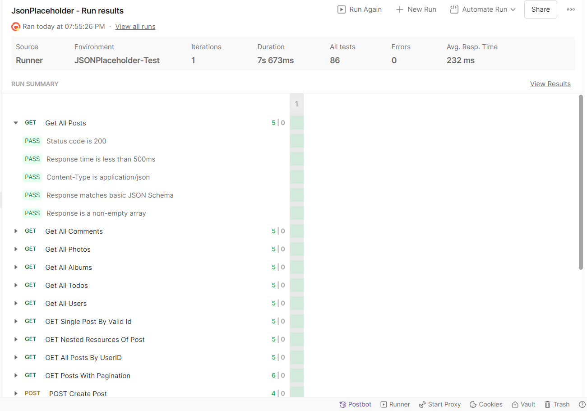

# API Testing Framework (Postman & JavaScript)

## 1. Introduction

This project provides an automated testing solution for the [JSON Placeholder](https://typicode.com) REST API service.

**Project Goal:** To demonstrate advanced proficiency in REST API testing.

## 2. Tech Stack

 

* **Postman** — API development and testing environment.
* **JavaScript (Node.js)** — automation scripting (Pre-request / Post-response snippets)

## 3. Test Architecture

The project is structured into logical layers following the test pyramid principles:

* **Smoke Tests:** High-level health checks for core endpoints (/posts, /comments, /users, etc.). Verifies status codes (200 OK), response time and basic JSON scheme validation.
* **Functional Tests:** Deep coverage of CRUD operations, pagination, filtering and resource relationship logic.
* **Negative Tests:** System resilience validation against malformed data (invalid JSON, incorrect data types, 404 scenarios).
* **E2E Scenario:** A comprehensive "Life of a Post" flow (Create -> Get -> Update -> Delete) using dynamic data chaining.

  
Click to view the full Test Cases list

### Smoke tests

  1. Get All Posts

  2. Get All Comments

  3. Get All Photos

  4. Get All Albums

  5. Get All Todos

  6. Get All Users

### Functional tests

  7. Get a single post by valid ID

  8. Get nested resources of a post

  9. Filter posts by userId parameter

  10. Get posts with pagination (limit and page)

  11. Create a new post (POST)

  12. Full post update (PUT)

  13. Partial body update (PATCH)

  14. Delete a post (DELETE)

### Negative tests

  15. Get non-existent post (404)

  16. Get posts by invalid query parameter

  17. OST request with malformed JSON syntax

  18. OST request with an empty JSON body

### E2E scenario

* Post Lifecycle Management (Sequential workflow)

## 4. Key Technical Features

* **Dynamic Data:** Using `{{$randomInt}}` and Faker libraries to ensure unique test data for every execution.
* **Contract Testing:** Each functional test includes  **JSON Schema Validation** to ensure data integrity.
* **Teardown & Cleanup:** Automated environment variable cleanup after E2E scenario completion to maintain workspace hygiene.
* **Environmental Variables:** Centralized configuration for Base URL, global headers and timeout thresholds via Environment variables.

## 5. How to Run

1. Clone the repository.
2. Import `JsonPlaceholder.postman_collection.json` and `JSONPlaceholder-Test.postman_environment.json` into Postman.
3. Select the `JSONPlaceholder-Test` environment.
4. Open the Collection Runner and click **Run** to execute the entire suite.

